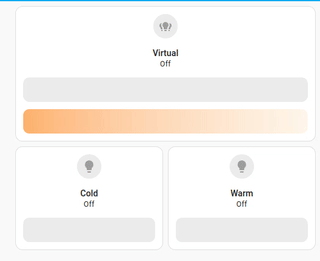

# Color temperature light mixer

[![GitHub Release][releases-shield]][releases]
[![GitHub Activity][commits-shield]][commits]
[![License][license-shield]](LICENSE)

[![hacs][hacs-shield]][hacs]
[![Project Maintenance][maintenance-shield]][user_profile]

[![Community Forum][forum-shield]][forum]

Home Assistant integration to group multiple light sources into a single "virtual" color temperature-changing light.

Useful for instance with LED strips having separate cold white/warm white channels (CCT or CWWW LED), in which two separate light entities are exposed in Home Assistant, one for each color temperature. This integration groups together the two lights, allowing them to be controlled as a single entity in HA.

An example application is a "dumb"/analog LED strip with controlled by a Shelly RGBW2, configured in _4 white channels_ mode, where the cold light and warm light channels are each controlled by a separate channel in the Shelly.

<p align="center">
    
</p>

## Installation

### Install from HACS (recommended)

1. Have [HACS][hacs] installed, this will allow you to easily manage and track updates.
1. Add this repository as a _custom repository_ or just press the button below:\
[][hacs-repository]
1. Once added, search in HACS for "Color temperature light mixer".
1. Click Install.
1. _If you want to configure component via Home Assistant UI..._\
    in the HA UI go to "Configuration" > "Integrations" click "+" and search for "Color temperature light mixer".
1. _If you want to configure component via `configuration.yaml`..._\
    follow the instructions below, then restart Home Assistant.

### Manual installation

1. Using the tool of choice open the directory (folder) for your HA configuration (where you find `configuration.yaml`).
1. If you do not have a `custom_components` directory (folder) there, you need to create it.
1. In the `custom_components` directory (folder) create a new folder called `light_temperature_mixer`.
1. Download file `integration_blueprint.zip` from the [latest release section][releases-latest] in this repository.
1. Extract _all_ files from this archive you downloaded in the directory (folder) you created.
1. Restart Home Assistant
1. _If you want to configure component via Home Assistant UI..._\
    in the HA UI go to "Configuration" > "Integrations" click "+" and search for "Color temperature light mixer".
1. _If you want to configure component via `configuration.yaml`..._\
    follow the instructions below, then restart Home Assistant.

## Configuration

The integration can be configured via either HA UI and YAML.

The following configuration options are supported:

Name | Description
-- | --
`name` | The name of the "virtual" color changing temperature light.
`warm_light_entity_id` | The `entity_id` representing the warm light (having yellow-ish color)
`warm_light_color_temp_kelvin` | The color temperature of the warm light, in Kelvin
`cold_light_entity_id` | The `entity_id` representing the cold light (having blu-ish color)
`cold_light_color_temp_kelvin` | The color temperature of the warm light, in Kelvin


### YAML file

The same configuration can be achieved by adding the following to you `configuration.yaml` file.
For instance:

```yaml
light_temperature_mixer:
  - name: Virtual
    warm_light_entity_id: light.warm_white
    warm_light_color_temp_kelvin: 3000
    cold_light_entity_id: light.cold_white
    cold_light_color_temp_kelvin: 6000
```

**This integration will set up the following platforms:**

Platform | Description
-- | --
`light` | The color changing temperature light.
`sensor` | Two diagnostic sensors to maintain the state of the light across HA reboots.

## Track updates

You can automatically track new versions of this component and update it by [HACS][hacs].

## Known Limitations and issues

- This integration makes the assumption that 100% brightness is achieved when BOTH warm white and cold white LEDs are on. Check your lights to see if this type of setup is supported (whereas instead only one of the strips can be 100% power at a time).
- At the moment only two light sources are supported per "virtual" light.

## Troubleshooting

To enable debug logs use this configuration:
```yaml
# Example configuration.yaml entry
logger:
  default: info
  logs:
    custom_components.integration_blueprint: debug
```
... then restart HA.

## Contributions are welcome!

This is an active open-source project. We are always open to people who want to
use the code or contribute to it.

We have set up a separate document containing our
[contribution guidelines](CONTRIBUTING.md).

Thank you for being involved!

## Authors & contributors

For a full list of all authors and contributors, check [the contributor's page][contributors].

### Credits
The original inspiration came from the template light provided by [gfrancesco](https://github.com/gfrancesco/cwww-template-light-ha).

This Home Assistant custom component was created and is updated using the [HA-Blueprint template](https://github.com/Limych/ha-blueprint). You can use this template to maintain your own Home Assistant custom components.

***

[component]: https://github.com/Limych/ha-blueprint
[commits-shield]: https://img.shields.io/github/commit-activity/y/Limych/ha-blueprint.svg?style=popout
[commits]: https://github.com/Limych/ha-blueprint/commits/master
[hacs-shield]: https://img.shields.io/badge/HACS-Custom-orange.svg?style=popout
[hacs]: https://hacs.xyz
[hacs-repository]: https://my.home-assistant.io/redirect/hacs_repository/?owner=Limych&repository=ha-blueprint&category=integration
[exampleimg]: example.png
[forum-shield]: https://img.shields.io/badge/community-forum-brightgreen.svg?style=popout
[forum]: https://community.home-assistant.io/
[license]: https://github.com/Limych/ha-blueprint/blob/main/LICENSE.md
[license-shield]: https://img.shields.io/badge/license-Creative_Commons_BY--NC--SA_License-lightgray.svg?style=popout
[maintenance-shield]: https://img.shields.io/badge/maintainer-Andrey%20Khrolenok%20%40Limych-blue.svg?style=popout
[releases-shield]: https://img.shields.io/github/release/Limych/ha-blueprint.svg?style=popout
[releases]: https://github.com/mion00/ha-blueprint/releases
[releases-latest]: https://github.com/Limych/ha-blueprint/releases/latest
[user_profile]: https://github.com/mion00
[report_bug]: https://github.com/Limych/ha-blueprint/issues/new?template=bug_report.md
[suggest_idea]: https://github.com/Limych/ha-blueprint/issues/new?template=feature_request.md
[contributors]: https://github.com/Limych/ha-blueprint/graphs/contributors
[patreon-shield]: https://img.shields.io/endpoint.svg?url=https%3A%2F%2Fshieldsio-patreon.vercel.app%2Fapi%3Fusername%3DLimych%26type%3Dpatrons&style=popout
[patreon]: https://www.patreon.com/join/limych
